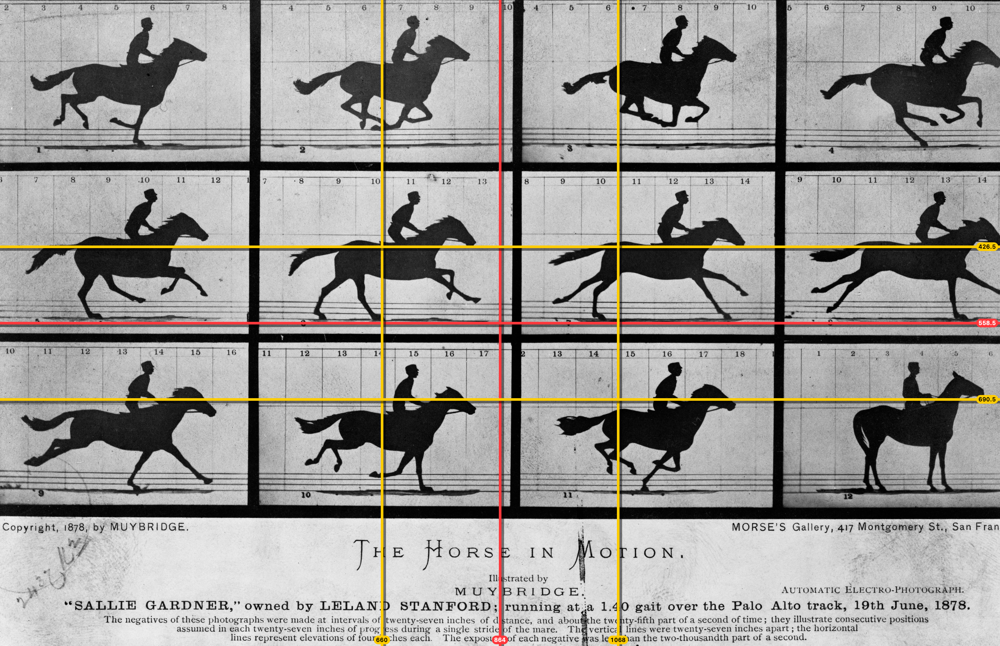

<picture><source media="(prefers-color-scheme: dark)" srcset="docs/icon-github-dark.png"></picture>

# Grids

Grid overlay for Mac. Halves, quarters, thirds, the golden ratio and an 8-pt grid over the whole screen; clicks pass through.

<picture><source media="(prefers-color-scheme: dark)" srcset="docs/muybridge.webp"></picture>

Apple silicon, macOS 13 or later.

## Install

```sh
brew install geragarazagh/tap/grids
```

Or download [`Grids.dmg`](https://github.com/geragarazagh/grids/releases/latest/download/Grids.dmg).
